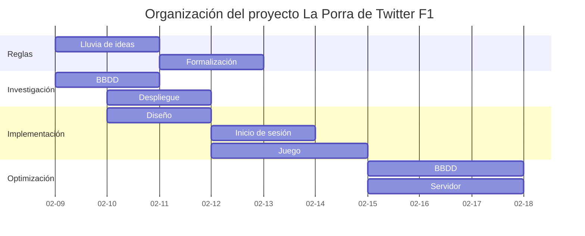

Esta es la historia de cómo llegamos a tener una web de Fórmula 1 con más de 400 usuarios hecha en tan solo 7 días.

## El comienzo

Durante el auge del fenómeno EL PLAN en Twitter, allá por Febrero de 2022, @manueljerez7_ y yo tuvimos la idea de crear una web a modo de porra para un conjunto reducido de amigos.
Aprovechamos que él tenía un grupo con otros usuarios de Twitter F1 que se reunían usando la herramienta Twitter Spaces para comentarles la idea. Les encantó, por lo que decidimos poner un Tweet para ver si a más gente le gustaba. Se viralizó.

<blockquote class="twitter-tweet">
CHAVALES este año se viene a TwF1 un super UPGRADE: UNA WEB SENCILLA para hacer LA PORRA DE LA CARRERA Te registras con tu usuario de Twitter, metes resultados y ves la clasificación general de puntos  Pronto os diré más 👀👀👀 Se agradece difusión para llegar a más gente 🙏
&mdash; Manu 😉 (@manueljerez7_) <a href="https://twitter.com/manueljerez7_/status/1492115818951417859?ref_src=twsrc%5Etfw">February 11, 2022</a></blockquote>  

700 Likes, 130 RT, 90.000 Visualizaciones... Fue una idea muy bien recibida por la comunidad, así que nos pusimos manos a la obra ya que quedaban a penas 2 semanas para el comienzo de temporada y tenía que estar todo listo, funcionando y probado para el primer Gran Premio.

## Cómo nos organizamos
Ambos estábamos cursando el grado de Ingeniería Telecomunicaciones en la Universidad de Sevilla, por lo que teníamos que organizar el poco tiempo sobrante que teníamos para llevar a cabo este proyecto.

## Ideas clave
De la fase de lluvia de ideas sacamos varias claves:

### - Inicio de sesión usando API Twitter

Es muy importante eliminar las barreras de entrada que pueda tener un usuario. Puesto que nuestra publicidad era Twitter, el registro en nuestra web se hará mediante su API. El usuario únicamente tendrá que dar acceso a su nombre de cuenta en Twitter y su @ será su usuario en la web.
Desde mi punto de vista, esto fue un completo acierto ya que el pulsar un botón de inicio de sesión con Twitter hace que el registro se vuelva automático y nada pesado.

### - Botón compartir en Twitter estilo Wordle
Wordle se había viralizado ya que la gente podía hacer el reto diario y compartir su famoso código de colores en Twitter, por lo que nosotros inventamos el nuestro propio.
Esto nos ayuda a llegar a un mayor público. Entrando en el hastag #LaPorraDeTwF1 se pueden comprobar los Tweets de los usuarios.

<blockquote class="twitter-tweet">
Mis resultados de <a href="https://twitter.com/hashtag/LaPorraDeTwF1?src=hash&amp;ref_src=twsrc%5Etfw">#LaPorraDeTwF1</a> para Bahrain 🟩 🟥 🟨 🟨 🟥 🟥 🟥 🟥 🟥 🟥
&mdash; Enrique Sánchez (@enriqueesanchz) <a href="https://twitter.com/enriqueesanchz/status/1505610789796917250?ref_src=twsrc%5Etfw">March 20, 2022</a></blockquote>  

### - Reglas
Las reglas se debatieron durante los primeros días para su posterior formalización. Básicamente consiste en colocar a los pilotos que creas que van a quedar los 10 primeros y según los resultados se te asigna una puntuación dependiendo de lo cerca que hayas estado de acertar.

## Investigación
Esta era una parte importante para decidir qué servicios íbamos a usar tanto para la Base de Datos como para dónde desplegar la Web, siempre intentando minimizar costes, ya que éramos estudiantes sin fuente de ingresos.

### - BBDD
Para la Base de Datos teníamos las posibilidades de Google Cloud SQL, Firebase, Azure SQL, AWS SQL Server, etc. Terminamos decantándonos por Azure ya que por $5 teníamos 2Gb de almacenamiento, costeándolo durante la temporada de Fórmula 1 con el plan para estudiantes.

### - Servidor
Otra parte vital es dónde desplegar la Web. Entre las diferentes opciones estaban de nuevo las plataformas de Google, Azure, AWS, etc. Al final elegimos Heroku con su plan gratuito ya que teníamos experiencia previa, Python y Flask. Cabe recalcar que teníamos algo de miedo por la viralización del Tweet y porque el número de usuarios que podríamos tener quizás hacía que la web cayese.

## Implementación
En esta parte ideamos cómo iban a ser los diferentes componentes de nuestra arquitectura, sus relaciones y dependencias, etc.
Comprende desde la implementación del inicio de sesión con Twitter para la web hasta la implementación del las reglas de la Porra en la Aplicación Web.

## Optimización
Durante estos días, estuve investigando sobre cómo optimizar al máximo nuestra web, en qué partes podíamos usar caché y en cuáles no, y otras optimizaciones de cara al servidor Web a usar, el número de hilos, etc. Estábamos preocupados por la viralización en Twitter.

## Conclusión
Se trata de una App Web sencilla, simple, hecha en tiempo récord, que cumple su función: Tener una porra a golpe de click desde Twitter, ideada para la comunidad de Twitter Fórmula 1.

Terminamos teniendo más de 400 usuarios, muy contentos, aunque sabemos que podrían haber sido más. Esto se debe a que la dificultad de conseguir un Tweet viral creció para cuando se iba a iniciar la temporada de F1 por lo que aunque con el Tweet del primer anuncio llegásemos a 90 mil visualizaciones, los que pusimos en las vísperas del primer Gran Premio obtuvieron muchas menos debido a la cantidad de información y tweets que hubo en aquella época.

Personalmente, considero todo un éxito este proyecto, en el cual he aprendido mucho con un ejemplo del mundo real y creo que la clave ha estado en centrarnos en la comodidad del usuario y la compartición en Twitter de los resultados con el código de colores.

