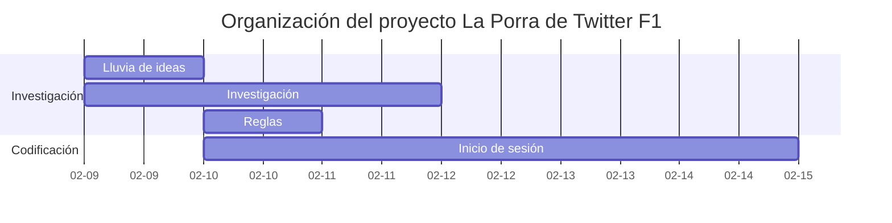

Esta es la historia de cómo llegamos a tener una web de Fórmula 1 con más de 400 usuarios hecha en tan solo 10 días.

## El comienzo

Durante el auge del fenómeno EL PLAN en Twitter, allá por Febrero de 2022, @manueljerez7_ y yo tuvimos la idea de crear una web a modo de porra para un conjunto reducido de amigos.
Aprovechamos que él tenía un grupo con otros usuarios de Twitter F1 que se reunían usando la herramienta Twitter Spaces para comentarles la idea. Les encantó, por lo que decidimos poner un Tweet para ver si a más gente le gustaba. El resultado fue el siguiente, se viralizó.

<blockquote class="twitter-tweet">
CHAVALES este año se viene a TwF1 un super UPGRADE: UNA WEB SENCILLA para hacer LA PORRA DE LA CARRERA Te registras con tu usuario de Twitter, metes resultados y ves la clasificación general de puntos  Pronto os diré más 👀👀👀 Se agradece difusión para llegar a más gente 🙏
&mdash; Manu 😉 (@manueljerez7_) <a href="https://twitter.com/manueljerez7_/status/1492115818951417859?ref_src=twsrc%5Etfw">February 11, 2022</a></blockquote>  

700 Likes, 130 RT, 90.000 Visualizaciones... Fue una idea muy bien recibida por la comunidad, así que nos pusimos manos a la obra ya que quedaban a penas 2 semanas para el comienzo de temporada y tenía que estar todo listo, funcionando y probado para el primer Gran Premio.

## Cómo nos organizamos

Ambos estábamos cursando el grado de Ingeniería Telecomunicaciones en la Universidad de Sevilla, por lo que teníamos que organizar el poco tiempo sobrante que teníamos para llevar a cabo este proyecto.

